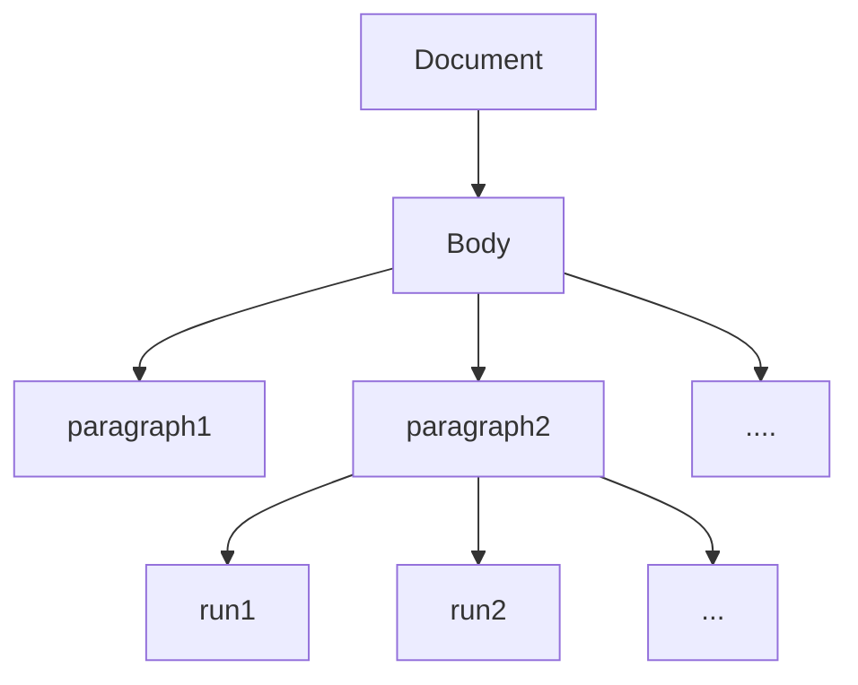
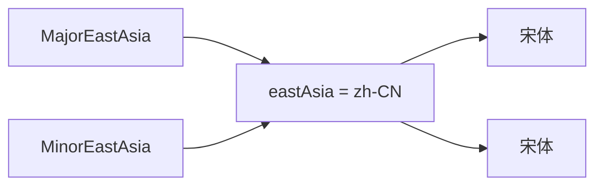
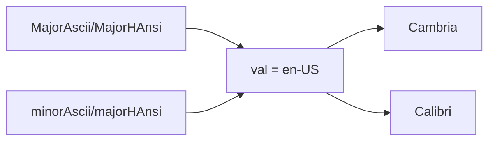

## Structure of a WordprocessingML document
- document

- body

	- **\<p\>** elements (block level elements such as paragraphs) 
		- **\<r\>** elements stand for **run** (a region of text with a common set of properties, such as formatting)
  			- **\<t\>** elements (contains a range of text)



<table aria-label="Table 1" class="table table-sm margin-top-none">
<thead>
<tr>
<th>WordprocessingML Element</th>
<th>Open XML SDK Class</th>
<th>Description</th>
</tr>
</thead>
<tbody>
<tr>
<td>document</td>
<td><a href="https://msdn.microsoft.com/library/office/documentformat.openxml.wordprocessing.document.aspx" data-linktype="external">Document</a></td>
<td>The root element for the main document part.</td>
</tr>
<tr>
<td>body</td>
<td><a href="https://msdn.microsoft.com/library/office/documentformat.openxml.wordprocessing.body.aspx" data-linktype="external">Body</a></td>
<td>The container for the block level structures such as paragraphs, tables, annotations and others specified in the <a href="https://www.iso.org/standard/71691.html" data-linktype="external">ISO/IEC 29500</a> specification.</td>
</tr>
<tr>
<td>p</td>
<td><a href="https://msdn.microsoft.com/library/office/documentformat.openxml.wordprocessing.paragraph.aspx" data-linktype="external">Paragraph</a></td>
<td>A paragraph.</td>
</tr>
<tr>
<td>r</td>
<td><a href="https://msdn.microsoft.com/library/office/documentformat.openxml.wordprocessing.run.aspx" data-linktype="external">Run</a></td>
<td>A run.</td>
</tr>
<tr>
<td>t</td>
<td><a href="https://msdn.microsoft.com/library/office/documentformat.openxml.wordprocessing.text.aspx" data-linktype="external">Text</a></td>
<td>A range of text.</td>
</tr>
</tbody>
</table>


## Important WordprocessingML Parts

<table aria-label="Table 1" class="table table-sm margin-top-none">
<thead>
<tr>
<th><strong>Package Part</strong></th>
<th><strong>WordprocessingML Element</strong></th>
<th><strong>Open XML SDK Class</strong></th>
<th><strong>Description</strong></th>
</tr>
</thead>
<tbody>
<tr>
<td>Main Document</td>
<td>document</td>
<td><a href="https://msdn.microsoft.com/library/office/documentformat.openxml.wordprocessing.document.aspx" data-linktype="external">Document</a></td>
<td>The root element for the main document part.</td>
</tr>
<tr>
    <td><b>Comments（批注）</b></td>
<td>comments</td>
<td><a href="https://msdn.microsoft.com/library/office/documentformat.openxml.wordprocessing.comments.aspx" data-linktype="external">Comments</a></td>
<td>The root element for the comments part.</td>
</tr>
<tr>
<td>Document Settings</td>
<td>settings</td>
<td><a href="https://msdn.microsoft.com/library/office/documentformat.openxml.wordprocessing.settings.aspx" data-linktype="external">Settings</a></td>
<td>The root element for the document settings part.</td>
</tr>
<tr>
<td>Endnotes</td>
<td>endnotes</td>
<td><a href="https://msdn.microsoft.com/library/office/documentformat.openxml.wordprocessing.endnotes.aspx" data-linktype="external">Endnotes</a></td>
<td>The root element for the endnotes part.</td>
</tr>
<tr>
<td>Footer</td>
<td>ftr</td>
<td><a href="https://msdn.microsoft.com/library/office/documentformat.openxml.wordprocessing.footer.aspx" data-linktype="external">Footer</a></td>
<td>The root element for the footer part.</td>
</tr>
<tr>
<td>Footnotes</td>
<td>footnotes</td>
<td><a href="https://msdn.microsoft.com/library/office/documentformat.openxml.wordprocessing.footnotes.aspx" data-linktype="external">Footnotes</a></td>
<td>The root element for the footnotes part.</td>
</tr>
<tr>
<td>Glossary Document</td>
<td>glossaryDocument</td>
<td><a href="https://msdn.microsoft.com/library/office/documentformat.openxml.wordprocessing.glossarydocument.aspx" data-linktype="external">GlossaryDocument</a></td>
<td>The root element for the glossary document part.</td>
</tr>
<tr>
<td>Header</td>
<td>hdr</td>
<td><a href="https://msdn.microsoft.com/library/office/documentformat.openxml.wordprocessing.header.aspx" data-linktype="external">Header</a></td>
<td>The root element for the header part.</td>
</tr>
<tr>
    <td><b>Style Definitions（样式）</b></td>
<td>styles</td>
<td><a href="https://msdn.microsoft.com/library/office/documentformat.openxml.wordprocessing.styles.aspx" data-linktype="external">Styles</a></td>
<td>The root element for a Style Definitions part.</td>
</tr>
</tbody>
</table>


## 创建一个最简单的doc

```csharp
using DocumentFormat.OpenXml.Packaging;
using DocumentFormat.OpenXml.Wordprocessing;

CreateWordDoc(args[0], args[1]);

static void CreateWordDoc(string filepath, string msg)
{
    using (WordprocessingDocument doc = WordprocessingDocument.Create(filepath, DocumentFormat.OpenXml.WordprocessingDocumentType.Document))
    {
        // Add a main document part. 
        MainDocumentPart mainPart = doc.AddMainDocumentPart();

        // Create the document structure and add some text.
        mainPart.Document = new Document();
        Body body = mainPart.Document.AppendChild(new Body());
        Paragraph para = body.AppendChild(new Paragraph());
        Run run = para.AppendChild(new Run());

        // String msg contains the text, "Hello, Word!"
        run.AppendChild(new Text(msg));
    }
}
```

1. ```csharp
   using DocumentFormat.OpenXml.Packaging;
   using DocumentFormat.OpenXml.Wordprocessing;
   ```

​	通过using来引入相应模块的命名空间(与C相同)

2. ```csharp
   CreateWordDoc(args[0], args[1]);
   ```

​	运行函数，值得注意的是，在Csharp之中，函数可以先使用，后声明并定义，**这一点与C不同**，可以理解为编译器在开始为我们自动添加了所有方法体的声明

3. ```csharp
   static void CreateWordDoc(string filepath, string msg)
   {
       // 方法体内容
   }
   ```

​	这里声明并定义了一个方法体(函数)，接受两个输入，`filepath`以及`message`

4. ```csharp
    using (WordprocessingDocument doc = WordprocessingDocument.Create(filepath, DocumentFormat.OpenXml.WordprocessingDocumentType.Document)){
        // 方法体内容
    }
   ```

​	这里的关键字`using`帮助我们控制变量的生命周期，它可以自动处理报错信息以确保内存被释放，关键字后可以不跟括号，其中的方法体内容可放置后续操作，申请的空间会在`using`结束后一同销毁，这里利用using返回了一个对象`WordprocessingDocument`的实例`doc`，传入的参数为`filepath`以及代表文档的Flag`DocumentFormat.OpenXml.WordprocessingDocumentType.Document`

5. ```csharp
   // Add a main document part. 
           MainDocumentPart mainPart = doc.AddMainDocumentPart();
   
           // Create the document structure and add some text.
           mainPart.Document = new Document();
           Body body = mainPart.Document.AppendChild(new Body());
           Paragraph para = body.AppendChild(new Paragraph());
           Run run = para.AppendChild(new Run());
   
           // String msg contains the text, "Hello, Word!"
           run.AppendChild(new Text(msg));
   ```

​	在获得`doc`之后，我们使用doc中的方法`AddMainDocumentPart()`向`doc`之中添加一个主要文档部分，并将其绑定到`MainDocumentPart`类型的变量`mainPart`上*(python)*，也可也理解为返回指针给`mainPart`*C*，之后通过每一个`AppendChild`函数来为上一级创建下一级的子类`Document->Body->Paragraph->Run->text`


## 从Wordprocessing文档之中提取样式

我们使用一个函数来完成这个部分

```csharp
public static XDocument ExtractStylesPart(
      string fileName,
      bool getStylesWithEffectsPart = true)
```

表示我们构建了一个静态公共函数`ExtractStylesPart`返回包含`style`信息或者`stylesWithEffects`信息的`XDocument`类的实例

我们可以通过以下代码来调用这个函数并将结果在控制台之中展示

​	注意: `Microsoft Word 2010` 的文本只有`styles`信息，而在`Microsoft Word 2013`以及后续的版本之中添加了`stylesWithEffects`部分，为了保持版本向下兼容，`Microsoft Word 2013`以及之后的版本同时保留了两个样式，但是较低级的版本遇到了无法识别的`stylesWithEffects`会忽略。

```csharp
string filename = @"C:\Users\Public\Documents\StylesFrom.docx";

    // Retrieve the StylesWithEffects part. You could pass false in the 
    // second parameter to retrieve the Styles part instead.
    var styles = ExtractStylesPart(filename, true);

    // If the part was retrieved, send the contents to the console.
    if (styles != null)
        Console.WriteLine(styles.ToString());
```

值得注意:

	1. `string`类型前的**`@`**用法同`python`之中的`f`,表示忽略转义
	1. `var`类表示不确定的动态类型，编译器会在运行时自动赋予这个关键字合适的类型
	3. 函数所接受的第二个`Bool`参数如下
	 	1. `true`返回`stylesWithEffects`信息
	 	2. `false`返回`styles`信息

```csharp
using DocumentFormat.OpenXml.Packaging;
using System;
using System.IO;
using System.Xml;
using System.Xml.Linq;

if (args is [{ } fileName, { } getStyleWithEffectsPart])
{
    ExtractStylesPart(fileName, getStyleWithEffectsPart);
}
else if (args is [{ } fileName2])
{
    ExtractStylesPart(fileName2);
}

// Extract the styles or stylesWithEffects part from a 
// word processing document as an XDocument instance.
static XDocument ExtractStylesPart(string fileName, string getStylesWithEffectsPart = "true")
{
    // Declare a variable to hold the XDocument.
    XDocument? styles = null;

    // Open the document for read access and get a reference.
    using (var document = WordprocessingDocument.Open(fileName, false))
    {
        if (document.MainDocumentPart is null || document.MainDocumentPart.StyleDefinitionsPart is null || document.MainDocumentPart.StylesWithEffectsPart is null)
        {
            throw new ArgumentNullException("MainDocumentPart and/or one or both of the Styles parts is null.");
        }

        // Get a reference to the main document part.
        var docPart = document.MainDocumentPart;

        // Assign a reference to the appropriate part to the
        // stylesPart variable.
        StylesPart? stylesPart = null;

        if (getStylesWithEffectsPart.ToLower() == "true")
            stylesPart = docPart.StylesWithEffectsPart;
        else
            stylesPart = docPart.StyleDefinitionsPart;

        using var reader = XmlNodeReader.Create(stylesPart.GetStream(FileMode.Open, FileAccess.Read));

        // Create the XDocument.
        styles = XDocument.Load(reader);
    }
    // Return the XDocument instance.
    return styles;
}
```

1. `args is [{ } fileName, { } getStyleWithEffectsPart]`是模板匹配语句，用来检测参数`args`符合匿名匹配`[{ }, { }]`的形式，就将其分别赋值给`filename`和`stylesWithEffects`

2. 类型`XDocument?`所定义变量表示这个变量能够接受所有的`XDocuments`类外加一个特殊值`null`，而没有这个`?`则只能使用引用特殊值，譬如在`int`里这个值通常是`0`

   

## 关于Run的属性

一个段落下的run可以由以下两种方法来获得

```csharp
IEnumerable<Run> runs = para.Descendants<Run>();
// 以迭代器的形式获取paragraph中的run
Run[] runs = para.Descendants<Run>().ToArray();   
// 以数组的形式获取paragraph中的run
```

这里，为了更好地理解，我们说明一下在`XML`之中一个`Run`块是怎样存在的

```xml
<w:r>
  <w:rPr>
    <w:b/>
    <w:color w:val="FF0000"/>
  </w:rPr>
  <w:t>Hello, World!</w:t>
</w:r>
```

`<w:r>`表示在命名空间`Wordprocessing`下的标签`Run`，通过标签`</w:r>`来闭合，其中包含一段具有相同属性的文本

 	1. `<w:rPr>`表示`RunProperties`，即`Run`的相关属性
 	 	1. `<w:b/>`表示`Bold`，表示**加粗**，其本身是自闭合标签，不需要额外的标签来闭合
 	 	2. `<w:rFonts>`表示`Run`中所使用的字体，**注意：此标签下的默认标签不显示**
 	 	3. `<w:color>`表示颜色，在这段例子之中其颜色为`FF0000`
 	 	4. .....
 	2. `<w:t>`表示`text`，表示`Run`之中所包含的`text`，通过标签`</w:t>`来闭合

接着，我们指出如何在`Csharp`中利用`OpenXml SDK`来获得这些标签下的内容。

|    标签    |      可直接使用属性      |             SDK提供的方法模板             |
| :--------: | :----------------------: | :---------------------------------------: |
|  `w:text`  |     `run.innertext`      |        `run.GetFirstChild<Text>()`        |
| `w:rFonts` | `runProperties.RunFonts` | `runProperties.GetFirstChild<RunFonts>()` |
|            |                          |                                           |


## 如何更改一个字体的加粗状态

```Csharp
...
Bold bold = new Bold(){Val = true};
runProperties.bold = bold;
```

中括号表示对于一个类变量下的属性进行初始赋值，这里`Bold.Val`会被复制为`True`


## 如何获取并更改Run下的字体

我们需要知道每个属性对应的字体

| 属性          | 含义                | 描述                                                         | 在XML中的标签 |
| ------------- | ------------------- | ------------------------------------------------------------ | ------------- |
| Ascii         | ASCII Font          | 指定 Unicode 编码范围为 U+0000–U+007F 内的字符应该使用的字体。也就是 ASCII 编码中的 128 个字符，包括英文字母、阿拉伯数字、英文标点符号等。 | ascii         |
| HighAnsi      | High ANSI Font      | 一些欧洲国家的扩展拉丁字母使用的字体。                       | hAnsi         |
| EastAsia      | East Asian Font     | 中日韩等东亚国家文字使用的字体。                             | eastAsia      |
| ComplexScript | Complex Script Font | 被定义为复杂文种使用的字体，如阿拉伯语                       | cs            |

可以通过以下例子来了解如何使用上述表格的对应关系来获取以及更改一个`Run`中的字体

```Csharp
...
string asciiFont = runFonts.Ascii;
string highAnsiFont = runFonts.HighAnsi; 
string eastAsiaFont = runFonts.EastAsia; 
string complexScriptFont = runFonts.ComplexScript;
//获取四种字体

runFonts.Ascii = "Times New Roman";
runFonts.HighAnsi = "Times New Roman";
runFonts.EastAsia = "华光准圆_CNKI";
//修改字体
```


## 如何获取默认字体

## 中文字符的多层样式应用规范

1. 如果当前字符所在的 `r` 元素中定义了`EastAsia(或EastAsiaTheme)`字体，则应用该字体，否则下一步；
2. 如果当前字符所在的 `r` 元素中定义了字符样式(`rStyle`元素)且字符样式中定义了`EastAsia`(或`EastAsiaTheme`)字体，则应用该字体，否则下一步：
3. 如果当前字符所在的 `p` 元素中定义了段落样式(`pStyle`元素)且段落样式或它的基样式中定义了`EastAsia`(或`EastAsiaTheme`)字体，则应用该字体，否则下一步；
4. 如果默认段落样式中定义了`EastAsia`(或`EastAsiaTheme`)字体，则应用该字体，否则下一步；
5. 如果文档的默认格式中定义了`EastAsia`(或`EastAsiaTheme`)字体，则应用该字体。

***

# Csharp学习

```csharp
IEnumerable<Paragraph> paragraphs = wordDoc.MainDocumentPart.Document.Descendants<Paragraph>();
```

​	可以理解为`python`之中的`iterator`，用于产生一个可迭代的迭代器

***


# 2024-12-30 第一次汇报


任务：利用`Csharp`结合`OpenXLM SDK`完成以下功能

- [x] 字体的检查
- [x] 图表编号不连续
- [ ] 页码不连续


## 准备知识(XML文档结构)

- document

- body

	- **\<p\>** elements (block level elements such as paragraphs) 
		- **\<r\>** elements stand for **run** (a region of text with a common set of properties, such as formatting)
  			- **\<t\>** elements (contains a range of text)


**一个最简单的HelloWord.docx例子**：

 ```xml
 <w:body>
   <w:p w14:paraId="57BE731A" w14:textId="2BEF9970" w:rsidR="00FF7599" w:rsidRDefault="001668BB">段落时间水印
     <w:pPr> 段落属性 ParagraphProperties
       <w:rPr> 运行区域属性 RunProperties 嵌套于段落属性之中，表示默认值
         <w:rFonts w:hint="eastAsia"/> 字体，提示为东亚字体
       </w:rPr>
     </w:pPr>
     <w:r> 第一个区域
       <w:rPr> 
         <w:rFonts w:hint="eastAsia"/>
       </w:rPr>
       <w:t>Hello Word
       </w:t>
     </w:r>
   </w:p>
   <w:sectPr w:rsidR="00FF7599"> 分节符
     <w:pgSz w:w="11906" w:h="16838"/>
     <w:pgMar w:top="1440" w:right="1800" w:bottom="1440" w:left="1800" w:header="851" w:footer="992" w:gutter="0"/>
     <w:cols w:space="425"/>
     <w:docGrid w:type="lines" w:linePitch="312"/>
   </w:sectPr>
 </w:body>
 ```


## 字体样式的检查

### Word文字确认逻辑

Word中，中文字体的确认逻辑

1. 查询当前字符所在的`r`中定义的`EastAsia（或EastAsiaTheme）`字体
2. 查询`r`中`rStyle`的定义
3. 查询当前字符所在的`p`中的`pStyle`定义
4. 查询段落默认样式的定义
5. 查询文档默认格式中的定义

获得`MajorAsia`或者`MinorAsia`变量，查询`Style`文件中`EastAsia`，即东亚字体所对应的语种，一般为`zh-CN`

在`Theme`文件之中查询`zh-CN`所对应的

```xml
<a:majorFont>
    <a:latin typeface="Cambria"/>
    <a:ea typeface=""/>
    <a:cs typeface=""/>
    <a:font script="Jpan" typeface="ＭＳ ゴシック"/>
    <a:font script="Hang" typeface="맑은 고딕"/>
    <a:font script="Hans" typeface="宋体"/>
</a:majorFont>
<a:minorFont>
    <a:latin typeface="Calibri"/>
    <a:ea typeface=""/>
    <a:cs typeface=""/>
    <a:font script="Jpan" typeface="ＭＳ 明朝"/>
    <a:font script="Hang" typeface="맑은 고딕"/>
    <a:font script="Hans" typeface="宋体"/>
</a:minorFont>
```

即表明，简体中文主要字体和次要字体都被定义为`宋体`，而东亚字体被定义为简体中文，即有如下对应关系



同样，我们可以得到默认字符的确定关系



自此，我们构建出了一个字符确认逻辑，即

 - 若`rPr`中指明字体，为**`宋体`**或`MajorAsia`，我们直接输出**`宋体`**或`MajorAsia`对应的字体
 - 若没有指明，就按照既定的顺序逐级查找，找到标签`<w:rFonts>`后，执行上一步


### 待解决的问题

 1. 在同一个`<w:rFonts>`之中，同时指明英文和中文字符，表示对一个`Run`，我们会识别其中的中文和英文字符，并对其进行分别的字体样式的解析，那面对中英文中共有的**`。`**该如何定义？

    ```xml
    <w:rFonts w:hint="eastAsia" w:ascii="Arial" w:eastAsia="微软雅黑" w:cs="宋体" />
    ```

    通过`w:hint`标签，我们设置默认字体为`eastAsia`，当字符位于不同语言的交叉区域时采用`eastAsia`所定义的**`微软雅黑`**，对于其他字体，我们采用**`宋体`**

```xml
<rPr>
	<w:rFonts w:ascii="Microsoft Himalaya" w:eastAsia="微软雅黑" w:hAnsi="Microsoft Himalaya" w:cs="Microsoft Himalaya"/>
</rPr>
<w:t>ཁམས་བཟང་འཛམ་གླིང</w:t>
```

但我在实际使用时向文本中插入日语，发现其并没有按照文档中描述的那样采用`w:cs`提供的**`宋体`**，而是仍然使用**`微软雅黑`**，当我向文本中插入藏语时Word自动调节`ascii`和`cs`为`Microsoft Himalaya`，当我更改`cs`为`Arial`时，尽管没有`<w:hint>`，藏语仍然使用字体`Microsoft Himalay`而不是`Complex Script`中所定义的`Arial`。

由此可以得出，我们暂时不明确`eastAsia`，`cs`的交叉控制优先级，这会导致我们的脚本在涉及跨语言处理时可能会产生错误的结果。

2. 我尝试在`Theme`文件中更改`eastAsia = zh-TW`，按照上述的对应关系，此时缺省的`eastAisa`字体应为**`新細明體`**，但是经过多次实际测试，Word与WPS均没有按照这个对应关系来操作，`对eastAsia`的字符仍显示为`Hans`所定义的**`宋体`**，所以我们在编程时跳过这一层查询，对eastAsia直接到`theme`中找简体中文的默认字体，而并不经过`style`进行默认语言的跳转，这也会导致我们在涉及跨语言处理时产生错误的结果


### 可能的继续发展方向

1. 如果本文档撰写规范，假设标题应应用**黑体三号字**，正文全部使用**宋体小四**，并且标题是通过`Style`确认的**标题**，则我们可以通过`rPr`中所定义的字号大小或者`Style`中定义的样式名称`<w:name w:val="Title"/>`来进行自适应确定内容应对应的字体

   ~~不过你都用Style了真的会把字体搞错吗？~~

   但是，如果你并不规范撰写文档，例如完全手写的标题，没有应用样式和调整字号，则不会留下任何和正文有所区别的标签，仅从xml文件标签而不从文章内容来看，很难确定应该使用**黑体**还是**宋体**

***

## 图表编号不连续

首先，我们来介绍两种大家常用~~(也可能不常用)~~的图表编号形式

1. 题注编号

​	这也是`Word Office`希望我们采用的图表编号，它由域命令自动控制编号，每次你更新域时都会为每一个系列题注分配新的编号。

2. 段落编号

   如果你使用段落编号来为图表进行编号，非常幸运，当出现致命错误的时候Word无法修正，我们也同样无法修正(后续阐述为什么)

### 题注编号

这里应插入一段展示，内容包括

1. 如何建立一个题注编号
2. 有图片被删除之后会怎么样
3. 有图片从最开始加入会怎么样
4. 什么是域代码

```xml
<w:p w14:paraId="20362C61" w14:textId="6EA1B973" w:rsidR="00FF7599" w:rsidRDefault="00466228" w:rsidP="00466228">
    <w:pPr>
        <w:pStyle w:val="ae"/>
        <w:rPr>
            <w:rFonts w:hint="eastAsia"/>
        </w:rPr>
    </w:pPr>
    <w:r>
        <w:rPr>
            <w:rFonts w:hint="eastAsia"/>
        </w:rPr>
        <w:t>图</w:t> 展示文字
    </w:r>
    <w:r>
        <w:rPr>
            <w:rFonts w:hint="eastAsia"/>
        </w:rPr>
        <w:t xml:space="preserve"> </w:t>
    </w:r>
    <w:r> 域代码开始
        <w:rPr>
            <w:rFonts w:hint="eastAsia"/>
        </w:rPr>
        <w:fldChar w:fldCharType="begin"/>
    </w:r>
    <w:r>
        <w:rPr> 序列
            <w:rFonts w:hint="eastAsia"/>
        </w:rPr>
        <w:instrText xml:space="preserve"> SEQ </w:instrText>
    </w:r>
    <w:r> 序列名称
        <w:rPr>
            <w:rFonts w:hint="eastAsia"/>
        </w:rPr>
        <w:instrText>图</w:instrText> 
    </w:r>
    <w:r> 序列格式
        <w:rPr>
            <w:rFonts w:hint="eastAsia"/>
        </w:rPr>
        <w:instrText xml:space="preserve"> \* ARABIC </w:instrText> (这里还可以编写字符，定义从多少开始)
    </w:r>
    <w:r>
        <w:rPr>
            <w:rFonts w:hint="eastAsia"/>
        </w:rPr>
        <w:fldChar w:fldCharType="separate"/>
    </w:r>
    <w:r>
        <w:rPr>
            <w:rFonts w:hint="eastAsia"/>
            <w:noProof/>
        </w:rPr>
        <w:t>1</w:t> 生成的编号
    </w:r>
    <w:r>
        <w:rPr>
            <w:rFonts w:hint="eastAsia"/>
        </w:rPr>
        <w:fldChar w:fldCharType="end"/>
    </w:r>
</w:p>
```

题注编号通过域更新统一再分配序列，这意味着如果你忘记域更新，就无法再分配序列

因此，我们编写一个程序，在检测到域代码 SEQ时开始记录，得到编号名称，这就意味着我们要对它的编号 +1 ，我们将编号名称和当前应具有的编号存放在一个字典里，以标签`<w:noProof/>`为讯号，当接收到此标签时，如果在本段落里已经收到域代码`SEQ`和序列名称，我们就会开始对紧接着的`w:t`进行检测，如果序号不对，就会对其标红(当然，我们也可以直接改)

效果如下: 对乱序编号进行演示

1. 展示对正确顺序的编号
2. 删除中间图片后展示正确顺序编号


### 段落编号

如果你使用了段落编号，那么在正确的操作下不会出现任何问题，但是一旦出现问题，我们难以进行修复

此处插入一个展示

1. 插入五张左右图片
2. 对其进行段落编号
3. 删除中间一张图片，哇塞，编号实时自动更新了欸
4. 从尾部插入一张表
5. 把删除的图片加回来

至此，段落编号都能完美胜任，如果说怎么会出现错误，那只能是你在做编号的时候选择错误了段落编号的样式！导致两个段落编号具有相同的`Name`但是却具有不同的`ID`，在`XML`中，段落编号的样式保存在`numbering.xml`中

```xml
<w:abstractNum w:abstractNumId="1" w15:restartNumberingAfterBreak="0">
    <w:nsid w:val="15A76799"/>
    <w:multiLevelType w:val="hybridMultilevel"/>
    <w:tmpl w:val="BD644CF6"/>
    <w:lvl w:ilvl="0" w:tplc="1F3CC002">
        <w:start w:val="1"/>
        <w:numFmt w:val="decimal"/>
        <w:lvlText w:val="图%1."/>
        <w:lvlJc w:val="left"/>
        <w:pPr>
            <w:ind w:left="880" w:hanging="440"/>
        </w:pPr>
        <w:rPr>
            <w:rFonts w:hint="eastAsia"/>
        </w:rPr>
    </w:lvl>
    <w:lvl w:ilvl="1" w:tplc="04090019" w:tentative="1">
        <w:start w:val="1"/>
        <w:numFmt w:val="lowerLetter"/>
        <w:lvlText w:val="%2)"/>
        <w:lvlJc w:val="left"/>
        <w:pPr>
            <w:ind w:left="880" w:hanging="440"/>
        </w:pPr>
    </w:lvl>
    <w:lvl w:ilvl="2" w:tplc="0409001B" w:tentative="1">
        <w:start w:val="1"/>
        <w:numFmt w:val="lowerRoman"/>
        <w:lvlText w:val="%3."/>
        <w:lvlJc w:val="right"/>
        <w:pPr>
            <w:ind w:left="1320" w:hanging="440"/>
        </w:pPr>
    </w:lvl>
    <w:lvl w:ilvl="3" w:tplc="0409000F" w:tentative="1">
        <w:start w:val="1"/>
        <w:numFmt w:val="decimal"/>
        <w:lvlText w:val="%4."/>
        <w:lvlJc w:val="left"/>
        <w:pPr>
            <w:ind w:left="1760" w:hanging="440"/>
        </w:pPr>
    </w:lvl>
    <w:lvl w:ilvl="4" w:tplc="04090019" w:tentative="1">
        <w:start w:val="1"/>
        <w:numFmt w:val="lowerLetter"/>
        <w:lvlText w:val="%5)"/>
        <w:lvlJc w:val="left"/>
        <w:pPr>
            <w:ind w:left="2200" w:hanging="440"/>
        </w:pPr>
    </w:lvl>
    <w:lvl w:ilvl="5" w:tplc="0409001B" w:tentative="1">
        <w:start w:val="1"/>
        <w:numFmt w:val="lowerRoman"/>
        <w:lvlText w:val="%6."/>
        <w:lvlJc w:val="right"/>
        <w:pPr>
            <w:ind w:left="2640" w:hanging="440"/>
        </w:pPr>
    </w:lvl>
    <w:lvl w:ilvl="6" w:tplc="0409000F" w:tentative="1">
        <w:start w:val="1"/>
        <w:numFmt w:val="decimal"/>
        <w:lvlText w:val="%7."/>
        <w:lvlJc w:val="left"/>
        <w:pPr>
            <w:ind w:left="3080" w:hanging="440"/>
        </w:pPr>
    </w:lvl>
    <w:lvl w:ilvl="7" w:tplc="04090019" w:tentative="1">
        <w:start w:val="1"/>
        <w:numFmt w:val="lowerLetter"/>
        <w:lvlText w:val="%8)"/>
        <w:lvlJc w:val="left"/>
        <w:pPr>
            <w:ind w:left="3520" w:hanging="440"/>
        </w:pPr>
    </w:lvl>
    <w:lvl w:ilvl="8" w:tplc="0409001B" w:tentative="1">
        <w:start w:val="1"/>
        <w:numFmt w:val="lowerRoman"/>
        <w:lvlText w:val="%9."/>
        <w:lvlJc w:val="right"/>
        <w:pPr>
            <w:ind w:left="3960" w:hanging="440"/>
        </w:pPr>
    </w:lvl>
</w:abstractNum>

```

而在正文之中，对段落编号的引用如下：

```xml
<w:pPr>
    <w:numPr><w:ilvl w:val="0"/><w:numId w:val="3"/></w:numPr>
</w:pPr>
```

这表示如果你选用的`numId`正确，`Word Office`会对其进行实时自动编号，如果你选择的编号Id错误，在不对文章内容进行分析的情况下`Word`和我们仅从xml文件来判断是无法对这个错误进行纠正的，因为它和普通段落编号并未任何区别，如果对其进行擅自纠正可能会对另外的段落编号产生影响。

***

## 页码不连续

这里我们要明确一个观点，页脚和页眉和正文一样，有属于自己的`Paragraph`

在正文之中，页脚是以页脚id的形式在`section`中被引用的，这表明一个**节**公用一个页脚

```xml
<w:sectPr w:rsidR="00FF7599">
    <w:footerReference w:type="default" r:id="rId6"/><w:pgSz w:w="11906" w:h="16838"/>
    <w:pgMar w:top="1440" w:right="1800" w:bottom="1440" w:left="1800" w:header="851" w:footer="992" w:gutter="0"/>
    <w:cols w:space="425"/>
    <w:docGrid w:type="lines" w:linePitch="312"/>
</w:sectPr>
```

这表明本节引用页脚为`id="rId6"`的页脚文件，在`document.xml.rels`中，我们可以看到，`id="rId6"`的页脚文件对应`footer1.xml`

```xml
<Relationships xmlns="http://schemas.openxmlformats.org/package/2006/relationships"><Relationship Id="rId8" Type="http://schemas.openxmlformats.org/officeDocument/2006/relationships/theme" Target="theme/theme1.xml"/>
    <Relationship Id="rId3" Type="http://schemas.openxmlformats.org/officeDocument/2006/relationships/webSettings" Target="webSettings.xml"/>
    <Relationship Id="rId7" Type="http://schemas.openxmlformats.org/officeDocument/2006/relationships/fontTable" Target="fontTable.xml"/>
    <Relationship Id="rId2" Type="http://schemas.openxmlformats.org/officeDocument/2006/relationships/settings" Target="settings.xml"/>
    <Relationship Id="rId1" Type="http://schemas.openxmlformats.org/officeDocument/2006/relationships/styles" Target="styles.xml"/>
    <Relationship Id="rId6" Type="http://schemas.openxmlformats.org/officeDocument/2006/relationships/footer" Target="footer1.xml"/>
    <Relationship Id="rId5" Type="http://schemas.openxmlformats.org/officeDocument/2006/relationships/endnotes" Target="endnotes.xml"/>
    <Relationship Id="rId4" Type="http://schemas.openxmlformats.org/officeDocument/2006/relationships/footnotes" Target="footnotes.xml"/>
</Relationships>
```

翻阅`footer1.xml`，我们发现如下内容

```xml
<w:p w14:paraId="76291710" w14:textId="7E32A655" w:rsidR="00BD77DE" w:rsidRDefault="00BD77DE">
    <w:pPr>
        <w:pStyle w:val="af0"/>
        <w:jc w:val="right"/>
        <w:rPr>
            <w:rFonts w:hint="eastAsia"/>
        </w:rPr>
    </w:pPr>
    <w:r>
        <w:fldChar w:fldCharType="begin"/>
    </w:r>
    <w:r>
        <w:instrText>PAGE \* MERGEFORMAT</w:instrText>
    </w:r>
    <w:r>
        <w:fldChar w:fldCharType="separate"/>
    </w:r>
    <w:r>
        <w:rPr>
            <w:lang w:val="zh-CN"/>
        </w:rPr>
        <w:t>2</w:t>
    </w:r>
    <w:r>
        <w:fldChar w:fldCharType="end"/>
    </w:r>
</w:p>
```

此内容中定义了一个段落，包括采用的`Style`，位置为`right`，通过`<w:instrText>PAGE \* MERGEFORMAT</w:instrText>`来完成自动计数，那个`<w:t>2</w:t>`只是事例，没有实际作用

以上内容表明，正文中以节属性的形式引用页脚，页码在页脚文件中被格式化定义，**具体页码是`Word Office`打开`docx`文件后实时渲染的**，这个渲染的过程比较复杂，需要综合考虑同一行内容不同`Run`下的字号，插入图片的大小，图片和文字之间的间距，文字的行间距，页面的上下以及左右边距，这些都会导致最终渲染出不同的页码总量。

而我们如果想仅仅通过`xml`文件来模拟计算这个渲染的过程从而得出当前文本内容所处的位置属于多少页码的过程是极为困难的。所以**我们无法得知文本内容所处的位置的页码**，即使有页码开始标志，我们仍然无法进行推算。

其次，如果文档分节正确，自动渲染的页码也不会出错，因为页码是通过域代码`{PAGE \* MERGEFORMAT}`来进行控制的`PAGE`返回给`Word`以上一个分节符为参考点，当前位置为第几页，开关`\* MERGEFORMAT `则负责控制域更新后格式是否保留。反之则说明，当你的页码出现错误时，往往是你的分节发生了错误，在不对文章内容进行分析的情况下，我们仅通过xml文件无从得知此处分节应该被保留还是去除。

所以得出，页码不连续的问题往往是更深层的问题引起的，我们很难单通过对XML文件标签结构进行分析进行纠正。


***


# 2025-01-06第二次汇报

***

## 任务清单

- [x] 大纲等级与样式的关系
- [x] 通过样式判断字体 (已完成修订handle函数)
- [x] 综合判断图片标号
- [x] 检查节的数量

***

## 大纲与样式的关系

### 什么是大纲等级?

1. 作为`pPr`的子标签存在
2. 在`xml`文件当中，大纲等级以标签`<w:outlineLvl w:val="1"/>`确定
3. 大纲等级自`0`开始作为**第一级大纲**

### 如何确定大纲等级？

`Microsoft Word Office`判断大纲等级是先查询`pStyle`中的大纲等级，若为空，再应用本段`pPr`中所定义的大纲等级，这一点与字体的确认是相反的。微软官方社区声称，这不是bug，而是一种设计理念，当你应用样式时，大纲等级会优先采用样式中的等级。这会导致我们在`Microsoft Word Office`中无法对已有大纲等级定义的样式进行大纲等级编辑。

***

## 通过样式判断字体

在部队文章内容进行分析的情况下，我们坚定认为，一段文字的样式设置是绝对正确的，基于此，我们要做的是：


1. 通过批注更改字体
  1. 查询样式中的字体
  2. 比对`run`中的字体
  3. 若不同，则提出批注，进行字体更改
2. 直接更改字体

   1. 对所有的`run`中的字体进行删除

### 可能出现的样式和字体的组合

首先，我们在不对内容进行分析的情况下，以样式作为唯一的先验，认为样式中定义的字体是正确的字体。

目前已发现例如标题，数字，表格标题设置样式为**正文**导致出现问题


我们首先按顺序选取`rStyle`与`pStyle`中的字体，再与`Run`区块中的字体进行比较，会出现以下几种情况

| 样式字体 | 区块字体 | 最终字体    |
| -------- | -------- | ----------- |
| null     | null     | 正确字体(?) |
| A        | A        | 正确字体(A) |
| A        | null     | 正确字体    |
| null     | A        | 错误字体    |
| A        | B        | 错误字体    |

- 由于我们坚持样式字体是绝对正确的，当出现区块和样式冲突时，我们仅需要删除区块字体，就可以得到正确的样式字体
- **但是使用`Microsoft Word Office `时，若未经设置，其默认文档的默认样式的字体，也就是`null`字体通常为宋体**，但是老师所给的参考文件是经过样式设置的，其默认样式字体是正文所代表的**宋体**，所以接下来有几种方向
  - [x] 坚持样式即正确，不管默认样式是什么字体
  - [ ] 通过默认样式链查找本文档的默认样式，再通过查找样式表和Theme文档中默认样式所代表的字体，检验其是否为**宋体**

### 通过修订模式来进行字体的删除

首先，我们**默认在执行本程序之前你的文档中没有未处理的修订内容**

修订内容，标签为`<w:rPrChange>`，作为和`<w:rPr>`的子标签存在，其下保存着`<w:rPr>`作为修订之前的原内容，而`Run`中所具有的`<w:rPr>`记录了修订后的内容被渲染出来。

所以，修订分为以下几步（属性修改修订使用标签`w:rPrChange`，文字删除修订使用标签`w:del`，文字添加修订使用标签`w:ins`）

1. 记录原本的内容，作为类`PreviousRunProperties`，并生成`Author`，`Date`，`Id`这三种修订信息(Date由于时差原因会落后八小时)
2. 使用修改后的内容替换原内容
3. 向`<w:rPr>`中添加属性修改修订块


***

## 综合判断图片标号

我们可以作为依据判断此段为标号的线索有：

1. 采用题注样式
   - **错误，已发现大量图表标号不为题注样式**，已禁用

2. 以**`图 {num} `**或**`表 {num}`**的形式作为段落的起始文本
	- **错误，发现以域代码定义的图表题注**
4. 判断此段为图或表之后，使用handle函数来处理序号


我们的代码完成按照以下流程

1. 按样式链获取到`rStyle`，`pStyle`
2. 判断样式是否为**题注**
   - 问题：字符样式链接到段落样式，导致显示的名称实际上与样式名称不同，可以考虑使用样式id
   - 
3. 若是，则提取首字(已进行空字符去除)与接下来的数字
4. 若首字为**图**或**表**则相应的全局计数器自增，并传递给handle函数用于比对处理


设计理念：

1. 我们认为图表题注是以单独段落的形式出现的
2. 对于一串连续的题注文本，我们认为它可能拥有很多`run`，我们认为，除首尾之外，在文本内部样式统一为"题注"，则**任意`Run`出现题注样式，我们认为此段为题注**实际上，题注之中一般存在三个`Run`区块，我们大部分时候是对第二个区块中的数字进行修改(只是一般)
3. (未实行)可以考虑将题注段落进行一次`Run`区块格式化，使之成为三个标准`Run`，便于修订模式添加

***

## 检查节的数量

```csharp
 static int GetSectionCount(string filePath) 
 {
     using (WordprocessingDocument wordDoc = WordprocessingDocument.Open(filePath, false)) 
     { 
         var body = wordDoc.MainDocumentPart.Document.Body; 
         var sections = body.Descendants<SectionProperties>();
         return sections.Count(); 
     } 
 }
```


